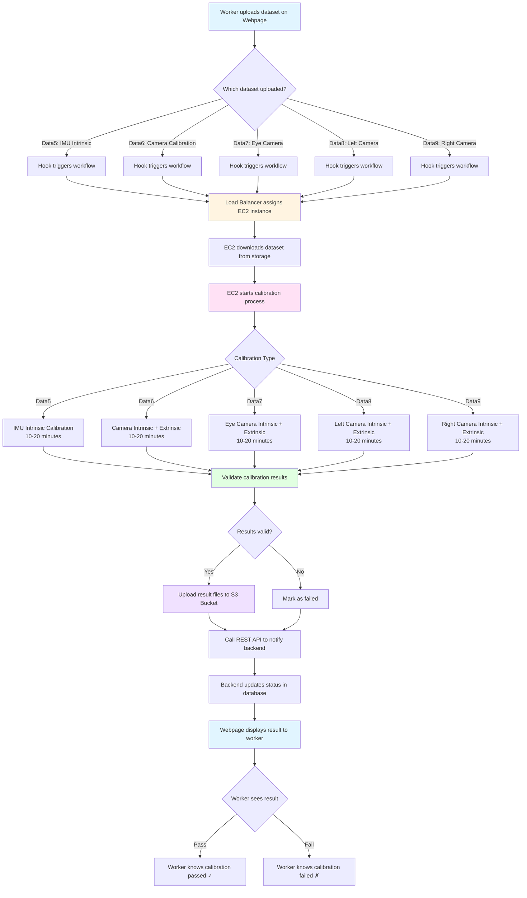

# Robocap Tools - Calibration System

A comprehensive calibration system for IMU and camera intrinsic/extrinsic calibration using Kalibr and IMU utils.

## Features

- **IMU Intrinsic Calibration**: Calibrate 3 IMUs (imu0, imu1, imu2) using imu_utils
- **Camera Intrinsic Calibration**: Calibrate camera intrinsic parameters using Kalibr
- **Camera-IMU Extrinsic Calibration**: Calibrate camera-IMU extrinsic parameters using Kalibr
- **Batch Calibration**: Automatically calibrate multiple devices with all calibration tasks
- **Result Recording**: Record calibration results to CSV files
- **S3 Upload**: Automatically upload calibration results to S3
- **Unified Architecture**: Modular design with reusable components

## Project Structure

```
robocap-tools/
├── scripts/                    # Main calibration scripts
│   ├── calib_imus_intrinsic.py          # IMU intrinsic calibration
│   ├── calib_cams_intrinsic.py          # Camera intrinsic calibration
│   ├── calib_cams_imu_extrinsic.py      # Camera-IMU extrinsic calibration
│   ├── batch_calibration_manager.py     # Batch calibration tool
│   ├── device_calibration_manager.py     # Single device calibration manager
│   ├── calibration_common.py             # Common utilities
│   ├── create_rosbag_from_db.py         # Rosbag creation from database
│   └── ...                               # Other helper modules
├── s3sdk/                      # S3 SDK for result upload
└── third_party/                # Third-party dependencies (Kalibr, IMU utils)
```

## Prerequisites

- Docker
- ROS Noetic
- Kalibr
- IMU Utils

## Installation

### 1. Clone Repository

```shell
git clone https://github.com/frodobots-org/robocap-tools.git
cd robocap-tools
```

### 2. Initialize Submodules

```shell
git submodule update --init --recursive
```

### 3. Build Docker Image

```shell
make
```

This will build the `robocap-calib` Docker image with all required dependencies.

## Dataset Organization

### Directory Structure

Organize your dataset directory as follows:

```
/data/
└── {device_id}/
    └── v1/
        ├── data5/              # IMU intrinsic calibration data
        ├── data6/              # Front camera calibration data
        ├── data7/              # Eye camera calibration data
        ├── data8/              # Left camera calibration data
        ├── data9/              # Right camera calibration data
        └── results/            # Calibration results (output)
```

### IMU Intrinsic Calibration Data Requirements

**Important**: For IMU intrinsic calibration, the device must remain **stationary** and record IMU data for **approximately 1.5 hours**. Due to this long recording duration, the data is typically split into multiple segment files.

The `data5` directory will contain multiple IMU database files for each IMU device (dev0, dev1, dev2), organized by segments:

- Format: `IMUWriter_dev{N}_session{S}_segment{G}.db` (multiple segments per device, typically 10-15 segments)

The system automatically merges all segment files for each IMU during calibration.

### Supported File Formats

**data5 (IMU Intrinsic):**
- IMU files: `IMUWriter_dev{N}_session{S}_segment{G}.db` (multiple segments per device)

**data6-data9 (Camera Calibration):**
- IMU files: `IMU0.db`, `IMU1.db`, `IMU2.db`
- Video files: `left-front.mp4`, `right-front.mp4`, `left-eye.mp4`, `right-eye.mp4`, `left.mp4`, `right.mp4`

### Example Dataset Structure

**Complete Example with IMU Segments:**

```shell
12d4730bb6a4382c/
└── v1/
    ├── data5/                          # IMU intrinsic (1.5 hours stationary recording)
    │   ├── IMUWriter_dev0_session4_segment1.db
    │   ├── IMUWriter_dev0_session4_segment2.db
    │   ├── IMUWriter_dev0_session4_segment3.db
    │   ├── ...                         # Multiple segments (typically 10-15 segments)
    │   ├── IMUWriter_dev0_session4_segment14.db
    │   ├── IMUWriter_dev1_session4_segment1.db
    │   ├── IMUWriter_dev1_session4_segment2.db
    │   ├── ...                         # dev1 segments
    │   ├── IMUWriter_dev2_session4_segment1.db
    │   ├── IMUWriter_dev2_session4_segment2.db
    │   └── ...                         # dev2 segments
    ├── data6/                          # Front cameras
│   │   ├── IMU0.db
│   │   ├── IMU1.db
│   │   ├── IMU2.db
│   │   ├── left-front.mp4
│   │   └── right-front.mp4
│   ├── data7/                          # Eye cameras
│   │   ├── IMU0.db
│   │   ├── IMU1.db
│   │   ├── IMU2.db
│   │   ├── left-eye.mp4
│   │   └── right-eye.mp4
│   ├── data8/                          # Left camera
│   │   ├── IMU0.db
│   │   ├── IMU1.db
│   │   ├── IMU2.db
│   │   └── left.mp4
│   ├── data9/                          # Right camera
│   │   ├── IMU0.db
│   │   ├── IMU1.db
│   │   ├── IMU2.db
│   │   └── right.mp4
│   └── results/                        # Calibration results (output)
│       ├── imus_intrinsic/
│       │   ├── imu_mid_0.yaml
│       │   ├── imu_right_1.yaml
│       │   └── imu_left_2.yaml
│       ├── imus_cam_lr_front_extrinsic/
│       │   ├── cam_lr_front_intrinsic-camchain.yaml
│       │   ├── imus_cam_lr_front_extrinsic-camchain-imucam.yaml
│       │   └── ...
│       └── ...
```

## Usage

### Running Docker Container

Mount your dataset and scripts directories:

```shell
docker run -it \
  -v /path/to/robocap-tools/scripts:/robocap-scripts \
  -v /path/to/dataset:/data \
  robocap-calib bash
```

### Setup ROS Environment

Inside the container:

```shell
source /opt/ros/noetic/setup.bash
/robocap-scripts/01_ros_env.sh
```

### Single Device Calibration

#### 1. IMU Intrinsic Calibration

Calibrates 3 IMUs (imu0: middle, imu1: right, imu2: left).

**Important Requirements:**
- The device must remain **stationary** during recording
- Recording duration: **approximately 1.5 hours**
- Data is typically split into multiple segment files (10-15 segments per IMU)
- The system automatically merges all segment files for each IMU during processing

```shell
python3 /robocap-scripts/calib_imus_intrinsic.py --device-id {device_id}
```

**Data Structure for data5:**
- Format: Multiple segment files per device (e.g., `IMUWriter_dev0_session4_segment1.db` through `segment14.db`)
- Typically 10-15 segments per IMU device

#### 2. Camera Intrinsic Calibration

Calibrate front, eye, left, or right cameras:

```shell
# Front cameras (left + right)
python3 /robocap-scripts/calib_cams_intrinsic.py front --device-id {device_id}

# Eye cameras (left + right)
python3 /robocap-scripts/calib_cams_intrinsic.py eye --device-id {device_id}

# Left camera
python3 /robocap-scripts/calib_cams_intrinsic.py left --device-id {device_id}

# Right camera
python3 /robocap-scripts/calib_cams_intrinsic.py right --device-id {device_id}
```

#### 3. Camera-IMU Extrinsic Calibration

Calibrate camera-IMU extrinsic parameters:

```shell
# Front cameras with all 3 IMUs
python3 /robocap-scripts/calib_cams_imu_extrinsic.py front --device-id {device_id}

# Eye cameras with all 3 IMUs
python3 /robocap-scripts/calib_cams_imu_extrinsic.py eye --device-id {device_id}

# Left camera with all 3 IMUs
python3 /robocap-scripts/calib_cams_imu_extrinsic.py left --device-id {device_id}

# Right camera with all 3 IMUs
python3 /robocap-scripts/calib_cams_imu_extrinsic.py right --device-id {device_id}
```

### Batch Calibration

Automatically calibrate all devices with all calibration tasks:

#### Auto-discover All Devices

```shell
python3 /robocap-scripts/batch_calibration_manager.py
```

#### Specify Device IDs

```shell
python3 /robocap-scripts/batch_calibration_manager.py \
  --device-ids faf2a598869ccfc8 device2 device3
```

#### With Custom CSV Output

```shell
python3 /robocap-scripts/batch_calibration_manager.py \
  --csv-file /tmp/calibration_results.csv
```

#### With S3 Upload

```shell
python3 /robocap-scripts/batch_calibration_manager.py \
  --s3-config /path/to/s3_config.json
```

#### Complete Example

```shell
python3 /robocap-scripts/batch_calibration_manager.py \
  --device-ids faf2a598869ccfc8 \
  --data-root /data \
  --scripts-dir /robocap-scripts \
  --csv-file /tmp/calibration_results.csv \
  --s3-config /path/to/s3_config.json
```

### Batch Calibration Tasks

Each device will be calibrated with the following 9 tasks in order:

1. **data5**: IMU intrinsic calibration (3 IMUs: imu0, imu1, imu2)
2. **data6**: Left-right front camera intrinsic calibration
3. **data6**: Left-right front camera-IMU extrinsic calibration
4. **data7**: Left-right eye camera intrinsic calibration
5. **data7**: Left-right eye camera-IMU extrinsic calibration
6. **data8**: Left camera intrinsic calibration
7. **data8**: Left camera-IMU extrinsic calibration
8. **data9**: Right camera intrinsic calibration
9. **data9**: Right camera-IMU extrinsic calibration

## Calibration Results

### Output Files

Calibration results are saved in the output directories defined in `robocap_env.py`:

- **IMU Intrinsic**: YAML files for each IMU (`imu_mid_0.yaml`, `imu_right_1.yaml`, `imu_left_2.yaml`)
- **Camera Intrinsic**: Camchain YAML files (`*-intrinsic-camchain.yaml`)
- **Camera-IMU Extrinsic**: Camchain YAML files (`*-camchain-imucam.yaml`) and IMU YAML files

### CSV Results

Batch calibration results are recorded in CSV format with the following columns:

- `device_id`: Device ID
- `timestamp`: Calibration timestamp
- `imu_intrinsic`: IMU intrinsic calibration result (Success/Failed)
- `cam_lr_front_intrinsic`: Front camera intrinsic result
- `cam_lr_front_extrinsic`: Front camera extrinsic result
- `cam_lr_front_extrinsic_cam0_reproj_error`: Front camera cam0 reprojection error
- `cam_lr_front_extrinsic_cam1_reproj_error`: Front camera cam1 reprojection error
- `cam_lr_eye_intrinsic`: Eye camera intrinsic result
- `cam_lr_eye_extrinsic`: Eye camera extrinsic result
- `cam_lr_eye_extrinsic_cam0_reproj_error`: Eye camera cam0 reprojection error
- `cam_lr_eye_extrinsic_cam1_reproj_error`: Eye camera cam1 reprojection error
- `cam_l_intrinsic`: Left camera intrinsic result
- `cam_l_extrinsic`: Left camera extrinsic result
- `cam_l_extrinsic_cam0_reproj_error`: Left camera reprojection error
- `cam_r_intrinsic`: Right camera intrinsic result
- `cam_r_extrinsic`: Right camera extrinsic result
- `cam_r_extrinsic_cam0_reproj_error`: Right camera reprojection error

### S3 Upload

If S3 configuration is provided, calibration results are automatically uploaded to S3 with the following path structure:

- IMU Intrinsic: `{device_id}/v1/results/imus_intrinsic/{filename}`
- Front Cameras: `{device_id}/v1/results/imus_cam_lr_front_extrinsic/{filename}`
- Eye Cameras: `{device_id}/v1/results/imus_cam_lr_eye_extrinsic/{filename}`
- Left Camera: `{device_id}/v1/results/imus_cam_l_extrinsic/{filename}`
- Right Camera: `{device_id}/v1/results/imus_cam_r_extrinsic/{filename}`

## Architecture

The calibration system uses a modular architecture:

```
Common Utilities Layer (calibration_common.py)
├── CommandExecutor          # Command execution
├── CalibrationLogger        # Logging
├── ConfigHelper            # Configuration retrieval
└── ArgumentParserHelper    # Argument parsing

Functional Modules Layer
├── RosbagCreator           # Rosbag creation
├── KalibrExecutor          # Kalibr execution
├── RosbagHelper            # Rosbag utilities
└── IMUCalibrationHelper    # IMU calibration utilities

Application Layer
├── calib_imus_intrinsic.py         # IMU intrinsic calibration
├── calib_cams_intrinsic.py         # Camera intrinsic calibration
├── calib_cams_imu_extrinsic.py     # Camera-IMU extrinsic calibration
└── batch_calibration_manager.py    # Batch calibration
```

## Command Line Options

### Common Options

All calibration scripts support the following common options:

- `--device-id`: Device ID (required if not set via environment variable)
- `--callback`: Path to callback module (optional)

### Batch Calibration Options

- `--device-ids`: List of device IDs to calibrate (optional, auto-discover if not specified)
- `--data-root`: Data root directory (default: `/data`)
- `--scripts-dir`: Script directory path (default: current script directory)
- `--csv-file`: CSV result file path (default: `/tmp/calibration_results.csv`)
- `--s3-config`: S3 configuration file path (optional)

## Timeouts

- **Single Task Timeout**: 3 hours per calibration task
- **Device Total Timeout**: 3 hours per device (for all tasks)
- **IMU Calibration Timeout**: 5 minutes per IMU

## Notes

- All code comments and documentation are in English
- data5 uses segment-based file format, while data6-data9 use simplified file names
- Intermediate files (.log and .bag) are automatically cleaned up after calibration
- Calibration results include reprojection errors for extrinsic calibrations
- The system supports automatic device discovery from the data directory structure

## Troubleshooting

### Common Issues

1. **Missing Data Directory**: Ensure the device directory exists under `/data/{device_id}/v1/`
2. **Missing Files**: Check that all required IMU and video files are present
3. **Timeout Errors**: Increase timeout values if calibration takes longer than expected
4. **S3 Upload Failures**: Verify S3 configuration file and credentials

## License

See LICENSE file for details.

## Contributing

Contributions are welcome! Please ensure all code comments and documentation are in English.

## Automatic Calibration Workflow

The system supports an automated calibration workflow where workers upload datasets through a web interface, and calibration tasks are automatically executed on EC2 instances.

### Workflow Diagram



### Workflow Steps

1. **Data Upload**: Worker uploads one of the five dataset groups (data5-data9) through the web interface

2. **Hook Trigger**: When upload completes, a webhook triggers the calibration workflow

3. **EC2 Assignment**: Load balancer assigns an available EC2 instance for calibration

4. **Data Download**: EC2 instance downloads the uploaded dataset

5. **Calibration Execution**: 
   - **Data5**: IMU intrinsic calibration (3 IMUs)
   - **Data6**: Front camera intrinsic + extrinsic calibration
   - **Data7**: Eye camera intrinsic + extrinsic calibration
   - **Data8**: Left camera intrinsic + extrinsic calibration
   - **Data9**: Right camera intrinsic + extrinsic calibration
   - Each calibration task takes **10-20 minutes**

6. **Result Validation**: Calibration results are validated for correctness

7. **Result Upload**: 
   - Valid results: Upload result files (YAML, PDF, TXT) to S3 Bucket
   - Invalid results: Mark as failed

8. **Status Notification**: REST API call notifies the backend system with calibration status (pass/fail)

9. **Status Display**: Backend updates the database and displays the result on the worker's webpage

10. **Worker Feedback**: Worker can see whether the calibration passed or failed for each dataset group

### Key Features

- **Automatic Processing**: No manual intervention required after data upload
- **Scalable**: Load balancer distributes calibration tasks across multiple EC2 instances
- **Real-time Status**: Workers can see calibration results in real-time on the web interface
- **Result Storage**: All calibration results are stored in S3 for future reference
- **Validation**: Results are validated before being marked as successful
