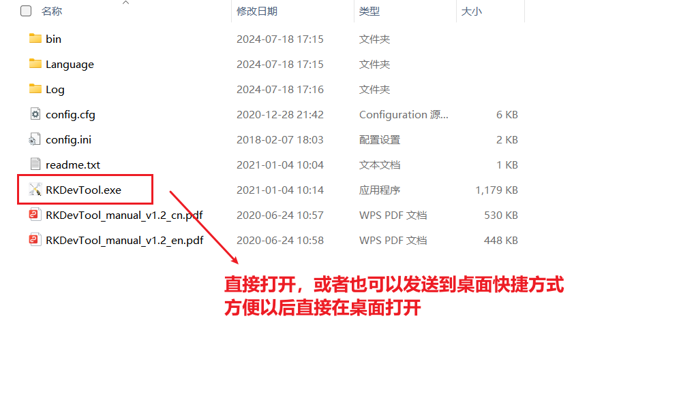
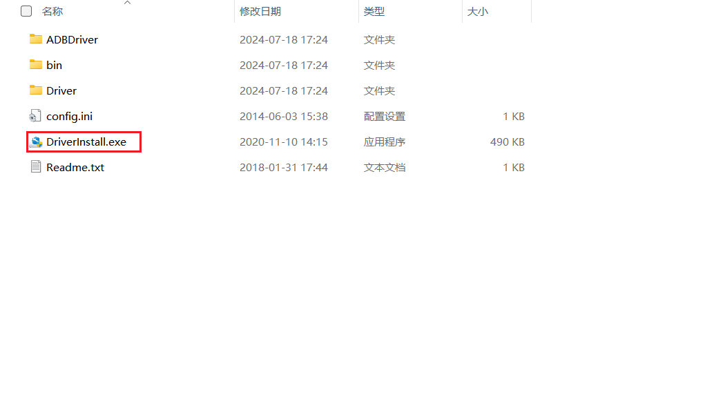

# Robocap Flashing Guide

## 0. Download Firmware

[Download](https://robocap-firmware.s3.ap-southeast-1.amazonaws.com/robocap-update-0.1.3-20251203-1801.img)

## 1. Install Flashing Tool

1. Download and extract the flashing tool package from github `RKDevTool_Release_v2.8.zip` (2.42MB).
2. Launch the `RKDevTool.exe` application from the extracted folder:
   - You can open it directly, or create a desktop shortcut for easier access later.

The extracted folder includes these files:

## 1.2 RK Driver Installation

1. Download and extract the `DriverAssistant_v5.1.1.zip` (9.36MB) from github.
2. Launch the `DriverInstall.exe` application from the extracted folder to install the driver.

The extracted folder includes these files:

## 2. Flash Firmware

1. Open the RK Development Tool (v2.8), then switch to the **"Upgrade Firmware"** tab.
2. Click **"Firmware"** to select your target firmware file.
3. Click **"Upgrade"** to start flashing.

> Note: The tool will show *"No device found"* initially —  a **maskrom device** or **loader device** should be detected first.

### How to enter maskrom/loader mode:

- Method 1: Press and hold the **V+ button** on the WIFI board while powering on the device, until the tool detects a loader/maskrom device.
- Method 2: Input the command `reboot loader` via the serial port or via the ssh cmdline.
- Method 3: Press and hold the **rec button** (the external extended control button = the recording button) for 5 seconds when the device is powered on. 
